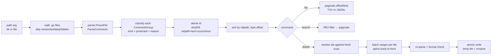

# Architecture

Standalone Go module (stdlib only). Public parsing/splicing core in `pkg/gocomments`, CLI-only concerns in `internal/cli`, thin entrypoint in `cmd/gocomments`.

```
gocomments/
├── cmd/gocomments/main.go   subcommand dispatch (list | search | delete | version)
├── internal/cli/            flag parsing, TSV/JSONL writers, pagination,
│                            id ingestion (--id/--ids/--stdin), git scoping
└── pkg/gocomments/          importable library:
    ├── scan.go              tree walk + go/parser (ParseComments), single-file mode
    ├── comment.go           Comment model + sha256 id derivation
    ├── classify.go          kind + protection classifier (directives, doc, cgo)
    └── delete.go            byte-range splice, atomic write, re-parse validation
```

## Pipeline



## Git scoping

`--diff <ref>` and `--commit <sha>` (list/search) shell out to `git`:

- `--diff`: `git diff -U0 <ref>` hunk headers → added-line ranges; working tree is scanned and rows are kept only where a comment span intersects an added range.
- `--commit`: ranges from `git diff -U0 <sha>^ <sha>`; file bytes come from `git show <sha>:<file>`, so the view is correct even if the working tree moved on. Root commits fall back to diffing against the empty tree.

Ids are computed the same way in every mode, so an id taken from a scoped listing resolves against the working tree in `delete` as long as the comment still exists.

## Key invariants

- Deletion never uses `printer.Fprint` — only byte splicing of the original source, so a one-comment removal is a one-line diff.
- Every rewritten file must re-parse and pass a `format.Source` check before the atomic rename; failures skip that file and the batch continues (exit code 1).
- Output ordering (relpath asc, byte offset asc) is a contract — it is what makes `--offset/--limit` pagination stable across runs.
- Protected comments (directives `//go:*`, `//line`, `//nolint`, `//export`, `// +build`, doc comments, cgo preambles) are never deleted without `--force`.
